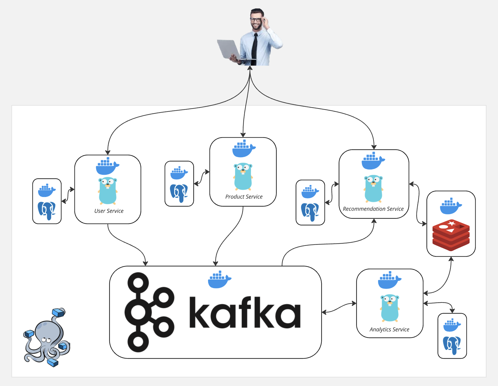

Для запуска в каждом сервисе (в папке services/<имя_сервиса>/config) следует положить файл .env,
в котором указать переменную окружения (ENVIRONMENT=local/dev/prod (выбрать нужную)) - это нужно
сделать для настройки логгера. 
Также в сервисе user (в файле services/user/config/.env) нужно указать
логин и пароль приложения (password app) от почты гугл, с помощью которой будут отправлятся коды подтверждения при регистрации нового пользователя
Если произовйдет ошибка, связанная с отсутствием или некорекностью этих данных, сервис будет работать штатно, но поисьма отправляться не будут.

