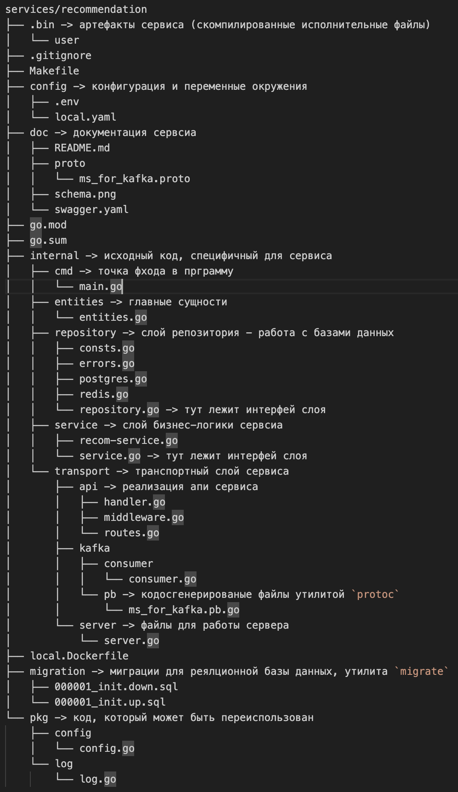

### Система рекомендаций для пользователей

#### Используемые технологии

#### *Контейнеры*
* Схема: 

Каждый сервис (`User`, `Recommendation`, `Analytics`, `Product`) поднимается в собственном контейнере, для каждого предусмотрена БД, которая тоже поднимается в отдельном контейнере.
Также есть контейнеры с `kafka`, `zookeeper`, `redis`, они оркестрируются с помощью `docker compose`

#### *Подход*
Разработка велась `сверху - вниз` - сначала был написан swagger-файл (aka openapi v2.0), описывающий эндпойнты сервиса, затем разрабатывалась ER-диаграмма для реляционной базы данных, в которую сервис будет обращаться, после же писался код в стиле чистой архитектуры: у каждого слоя сервиса есть интерфейс и тип данных - структура, его имплементирующая, также есть интерфейсы для реляционной и key-value БД в структуре repository.

#### *Файловая структура*
На примере сервиса recommendation:
* Структура: 

#### *ps*
Везде, где есть api предусмотрена валидация параметров и проверка корректности (не получится удалить несуществующий продукт, вернёт 404)
Более подробно о используемых библиотеках и фреймфорках можно почитать в README каждого сервиса