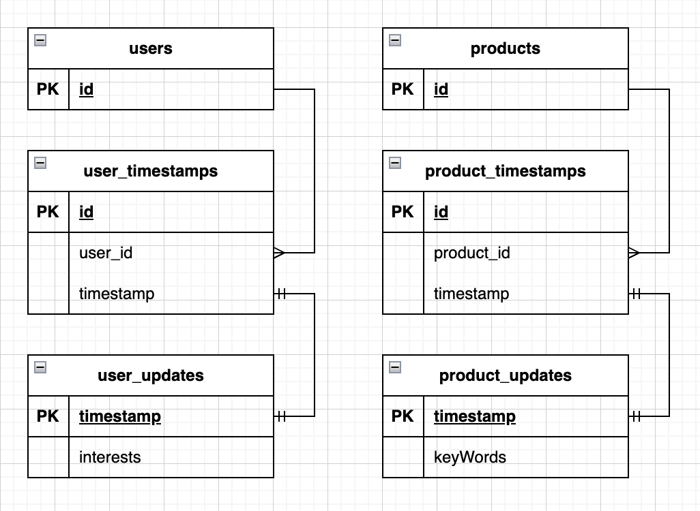

##### Технологии

###### Документация
* Документация по API составлена в виде файла спецификации и может быть просмотрена с помощью *SwaggerUI*

###### Код
* Логгирование реализовано с помощью *log/slog*
* Конфигурирование сервиса реализовано с помощью *viper* и *godotenv*
* Для подключения и работы с БД использована библиотека *sqlx* 
* Транспортный слой представлен только сообщениями пришедшими из кафки
* Для работы с kafka использовалась библиотека sarama
* Для работы с redis исполльзовалась беблиотека go-redis

###### БД
* Миграции представлены с помощью утилиты *migrate*
* Схема БД : 

###### Функционал
Сервис занимается сбором обновлений связанных с пользователями и продуктами и формированием информации об этих обновлениях