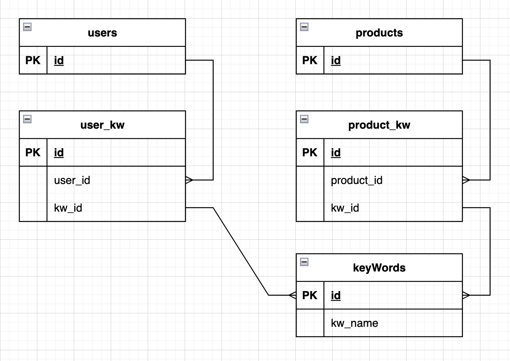
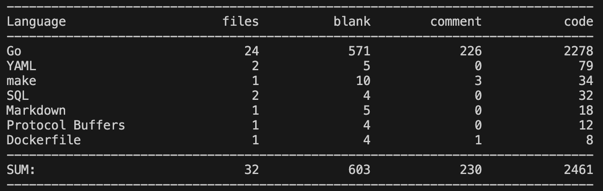

##### Технологии

###### Документация
* Документация по API составлена в виде файла спецификации и может быть просмотрена с помощью *SwaggerUI*

###### Код
* Логгирование реализовано с помощью *log/slog*
* Конфигурирование сервиса реализовано с помощью *viper* и *godotenv*
* Для подключения и работы с БД использована библиотека *sqlx* 
* Для транспортного слоя использовался веб-фреймворк *gin*
* Для работы с kafka использовалась библиотека sarama
* Для работы с redis исполльзовалась беблиотека go-redis

###### БД
* Миграции представлены с помощью утилиты *migrate*
* Схема БД : 

###### Примеры запросов
Протестировать можно с помощью Postman

* Запрос рекомендации для пользователя
`url`
http://localhost:8082/recommendation/5

###### Объем проделанной работы
