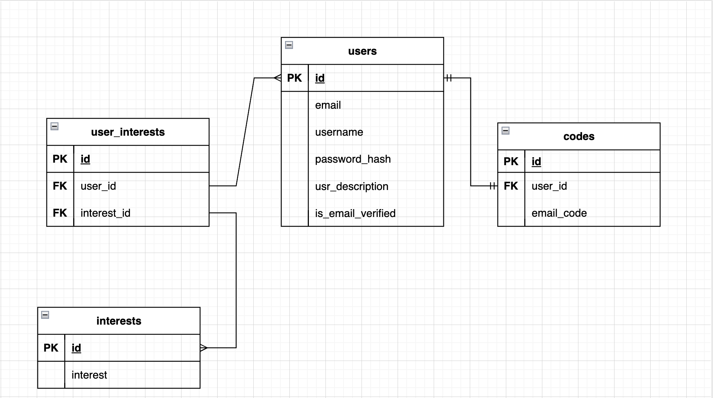

##### Технологии

###### Документация
* Документация по API составлена в виде файла спецификации и может быть просмотрена с помощью *SwaggerUI*

###### Код
* Логгирование реализовано с помощью *log/slog*
* Конфигурирование сервиса реализовано с помощью *viper* и *godotenv*
* Для подключения и работы с БД использована библиотека *sqlx* 
* Для транспортного слоя использовался веб-фреймворк *gin*

###### БД
* Миграции представлены с помощью утилиты *migrate*
* Схема БД : 
* В качестве реляционной БД используется postgres, драйвер github.com/lib/pq

###### Примеры запросов
Протестировать можно с помощью Postman

* Регистрация нового пользователя
`url` 
http://localhost:8080/user/sign-up
`body` 
{
  "username": "Uzhanin228",
  "email": "89253218@mail.ru",
  "password": "Password123)",
  "discription": "Молодой отец",
  "interests": [
    "кино"
  ],
  "age": 18
}

* Получение информации пользователя по email
`url`
http://localhost:8080/user/sign-up/email?email=89253218@mail.ru

* Получение информации пользователя по userId
`url`
http://localhost:8080/user/sign-up/userId?userId=1

* Обновление информации пользователя
`url`
http://localhost:8080/user/sign-up/1/edit
`body`
{
  "username": "user007",
  "email": "user@gmail.com",
  "password": "Password123)",
  "discription": "string",
  "interests": [
    "Манхва",
    "Футбол",
    "Сашими",
    "School"
  ],
  "age": 150
}